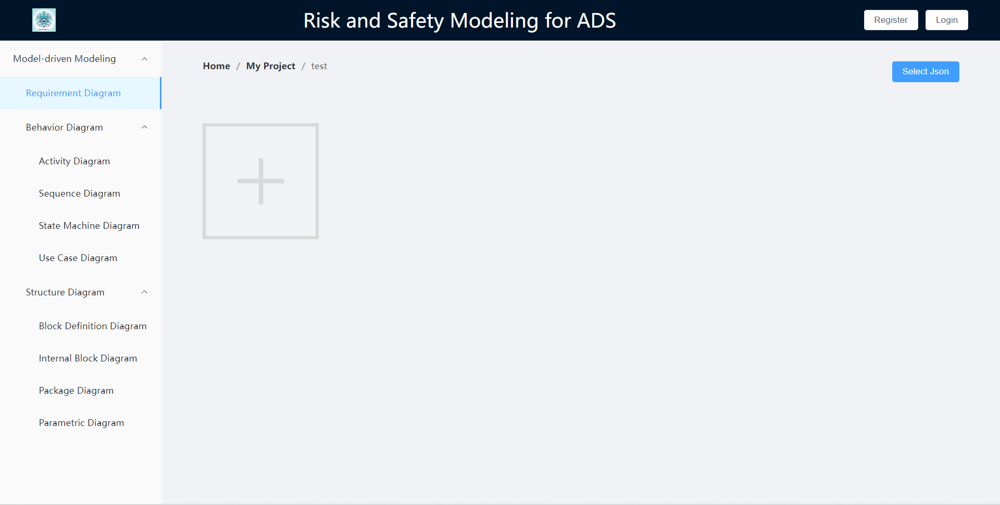
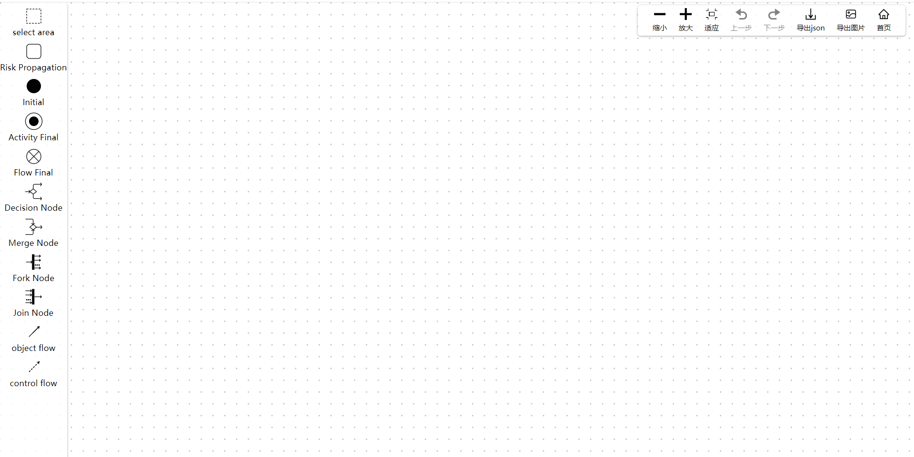
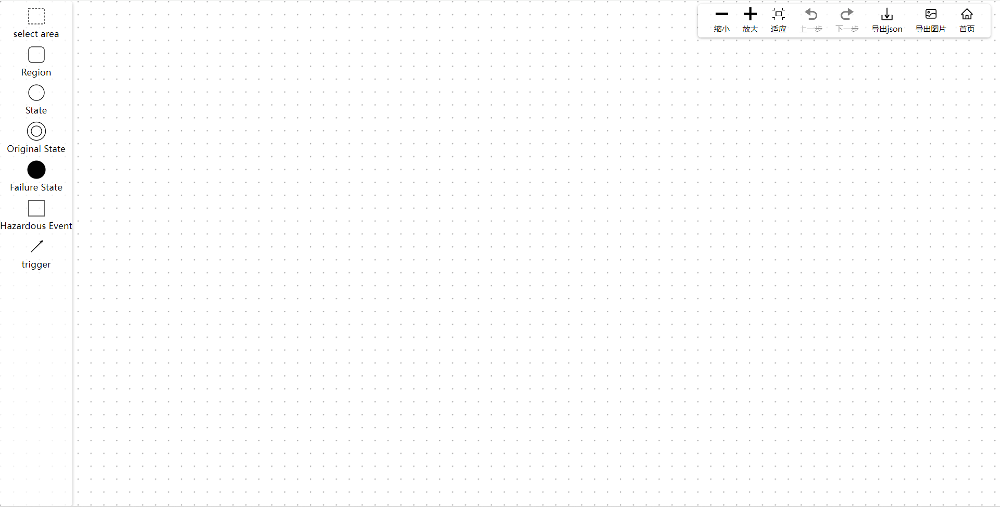
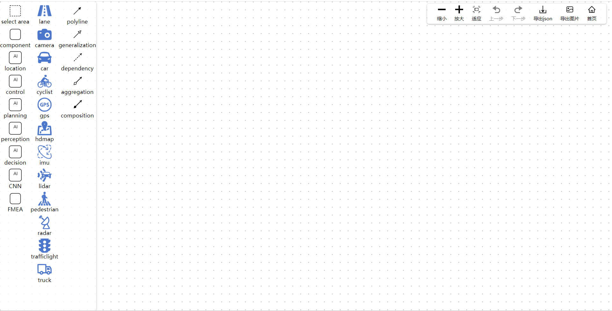

# SM4ADS (System Modeling for ADS)

## Project Overview

SM4ADS is a specialized graphical modeling tool developed for the field of (ADS) autonomous driving systems. It utilizes the SysML (System Modeling Language) for modeling purposes. This tool primarily extends five types of diagrams:

- Requirement Diagram
- Block Definition Diagram
- Internal Block Definition
- Activity Diagram
- State Machine Diagram

The tool aims to assis and engineers in modeling and designing ADS more efficiently.

## Key Features

- **Requirement Diagram:** it can be used to model the safety goals and functional safety requirements in ADS. Additionally, it's helpful in modeling the constraints of Operational Domain Design(ODD).
- **Block Definition Diagram:** it can be used to model various AI components within ADS, especially for modeling the perception component utilizing CNN technology.
- **Internal Block Definition:** it can be used to model the inner structure of AI components within ADS. To improve the expression, we've extended four more ports to model different kinds of interaction behaviors between AI components.
- **Activity Diagram:** it can be used to model the risk propagation path between individual AI components. For example, the failure or fault withnin perception component might have effects on decision-making component.
- **State Machine Diagram:** it can be used to model hazardous event that might trigger the component into failure state. We've also extended clock constraints on the trigger event so that we can further model-check the state transition of system state automata.

## Installation and Usage

### Installation Steps

1. Clone the project locally: `git clone https://github.com/your-username/SM4ADS.git`
2. Navigate to the project directory: `cd SM4ADS`

### Usage Instructions

This project is built using Vue 3. Before starting the project, ensure your computer has a recent version of Node.js installed. Then follow these steps:

1. **Install Dependencies**: Open your terminal and navigate to the project directory. Run the command `npm install` to install all the necessary dependencies for the project.

2. **Run the Project**: After the installation is complete, start the project by running `npm run dev`. This command will start the development server, and you can view the project in your browser by visiting `http://localhost:5173` (or a different port specified in the terminal).

3. **Production Build**: To build the project for production deployment, use the command `npm run build`. This will generate optimized files in the `dist` directory.

Make sure to review the `package.json` file for additional available scripts or configurations related to the project.

## Example Screenshots/Demo

## Contribution

Contributions and suggestions for improvement are highly valued. You can contribute to the project by:

### Submitting Issues

If you encounter any bugs, have feature requests, or wish to suggest enhancements, please [create an issue](https://github.com/your-username/SM4ADS/issues) on GitHub. Ensure to include detailed information regarding the problem or enhancement you're proposing. 

### Contributing Code

We welcome contributions through pull requests (PRs). If you'd like to add new features or fix existing issues, please follow these steps:

1. Fork the repository.
2. Create a new branch for your feature: `git checkout -b feature-name`.
3. Commit your changes: `git commit -am 'Added new feature'`.
4. Push to the branch: `git push origin feature-name`.
5. Submit a pull request.

For major changes, please discuss them first by creating an issue to propose your changes.

## Copyright and License

This project is licensed under the [MIT License](LICENSE).

